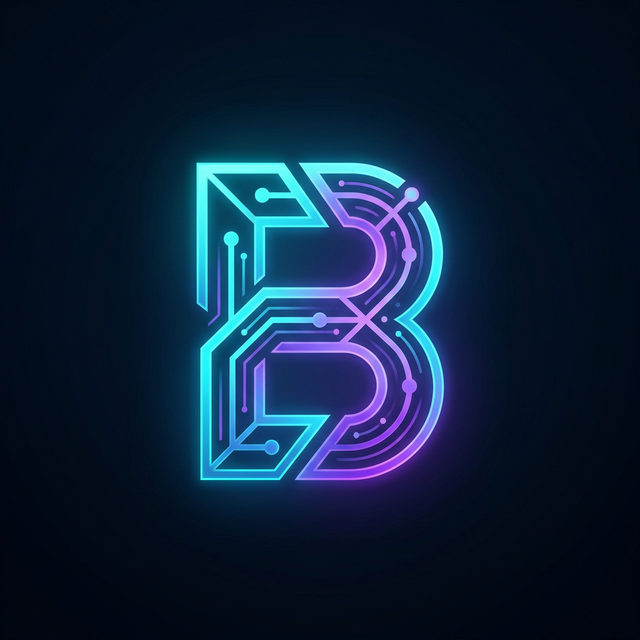

# 🌌 BuildWithMushfiq | Autonomous AI Systems Developer Portfolio

<div align="center">
  
  <h3>Modern. Intelligent. Futuristic.</h3>

[](https://vercel.com/new/clone?repository-url=https%3A%2F%2Fgithub.com%2Fuser%2Frepo)
[](https://railway.app/template/deploy?referrerId=user&category=ai&plugins=none&template=https%3A%2F%2Fgithub.com%2Fuser%2Frepo)
[](https://render.com/deploy?repo=https://github.com/user/repo)
[](https://app.netlify.com/start/deploy?repository=https://github.com/user/repo)

</div>

---

## 🚀 Overview

**BuildWithMushfiq** is a high-fidelity, autonomous portfolio system designed for the next generation of AI Systems Developers. It combines cutting-edge frontend aesthetics with a secure backend integrated with Google Gemini AI to provide real-time business automation insights, interactive system architectures, and intelligent project roadmaps.

### ✨ Key Features

- **🤖 AI Command Center (Ctrl + K):** A global search and AI assistant that answers questions about Mushfiq's expertise and projects.
- **🏗️ Interactive System Architecture:** Live, clickable diagrams showing how complex AI systems are built.
- **📅 AI Project Planner:** Input a business idea and get an instant technical roadmap, tech stack, and timeline.
- **💹 ROI & Automation Calculator:** Quantify the value of AI automation for your business.
- **💬 Smart AI ChatBot:** Persistent floating assistant powered by dynamic RAG (Retrieval-Augmented Generation) logic.
- **🌗 Liquid Theme Engine:** Seamless transition between Futuristic Dark and Sleek Light modes.
- **⚡ Supercharged Tech Stack:** React 19, Vite 7, Tailwind 4, and Framer Motion for buttery-smooth interactions.

---

## 🛠️ Tech Stack

### Frontend

- **Framework:** [React 19](https://react.dev/)
- **Build Tool:** [Vite 7](https://vitejs.dev/)
- **Styling:** [Tailwind CSS v4](https://tailwindcss.com/)
- **Animations:** [Framer Motion](https://www.framer.com/motion/)
- **3D Elements:** [Three.js](https://threejs.org/) / [R3F](https://r3f.docs.pmnd.rs/)
- **Icons:** [Lucide React](https://lucide.dev/)

### Backend

- **Runtime:** [Node.js](https://nodejs.org/)
- **Framework:** [Express](https://expressjs.com/)
- **AI Engine:** [Google Gemini API](https://ai.google.dev/)
- **Security:** Secure API proxying for API keys and rate limiting.

---

## 🛠️ Installation & Setup

### 1. Clone the Repository

```bash
git clone https://github.com/your-username/buildwithmushfiq.git
cd buildwithmushfiq
```

### 2. Configure Environment Variables

Create a `.env` file in the root directory:

```env
GEMINI_API_KEY=your_gemini_api_key_here
PORT=3001
VITE_API_URL=http://localhost:3001
```

### 3. Install Dependencies

```bash
npm install
```

### 4. Run Development Server

This will start both the React frontend (Port 3000) and the Express backend (Port 3001) concurrently.

```bash
npm run dev
```

---

## 📁 Project Structure

```bash
├── public/                 # Static assets for production (favicon, etc.)
├── server/                 # Express backend source code
│   └── index.ts            # Secure API entry point
├── src/                    # Frontend React application
│   ├── assets/             # Images and local media
│   ├── components/         # Reusable UI & Section components
│   ├── context/            # Theme & Global State contexts
│   ├── data/               # Portfolio information (personalInfo, projects, etc.)
│   ├── lib/                # Utility functions
│   └── services/           # API integration services
├── index.html              # Main HTML entry
├── tailwind.config.js      # CSS configuration
└── vite.config.ts          # Build configuration
```

---

## 📱 Responsiveness

The platform is meticulously optimized for:

- **Desktop:** Ultra-wide cinematic experience.
- **Laptop/Tablet:** Fluid bento-grid layouts.
- **Mobile:** Optimized 3D scenes and compact, readable navigation.

---

## 📄 License

This project is licensed under the MIT License - see the [LICENSE](LICENSE) file for details.

---

<div align="center">
  Built with ❤️ by <b>Mushfiqur Rahman</b>
</div>
